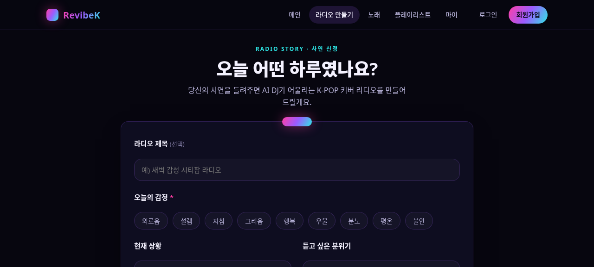
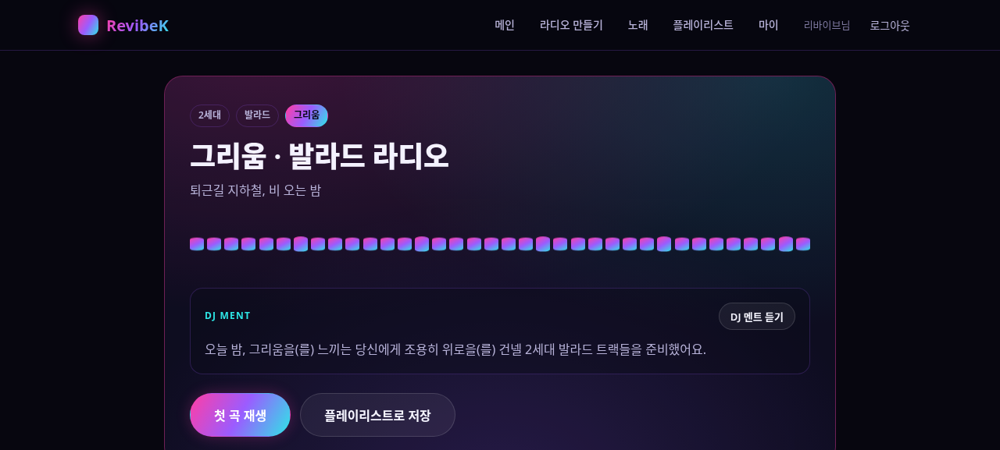
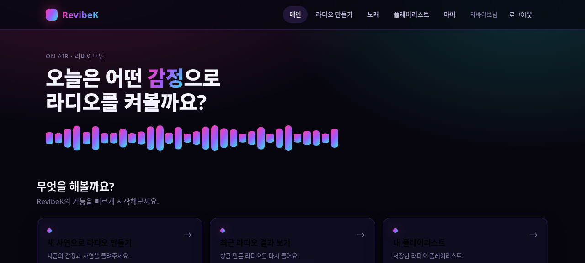
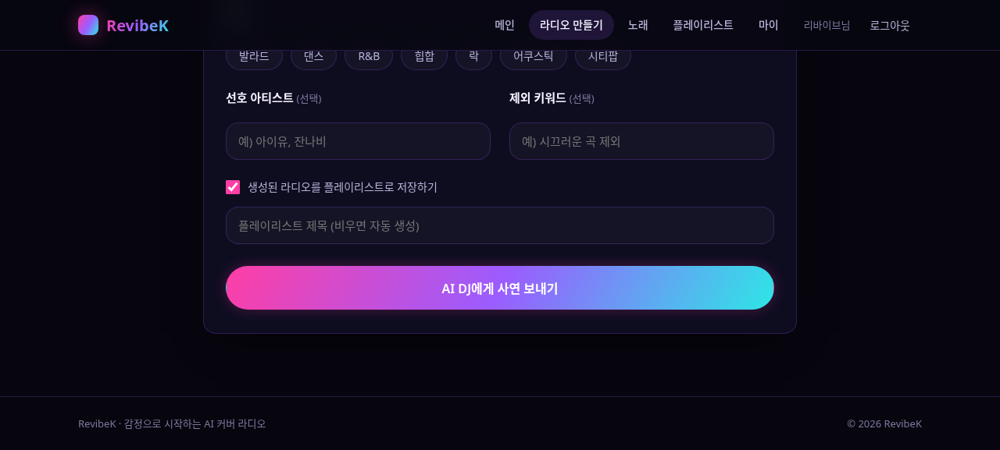
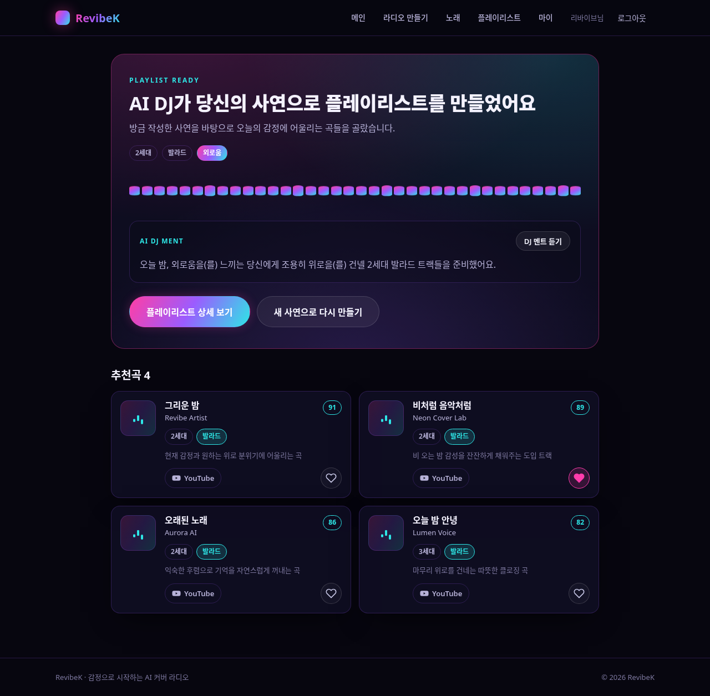
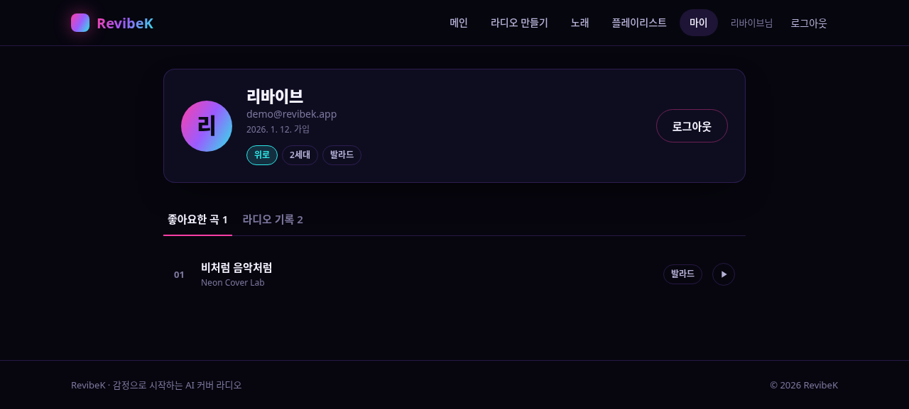
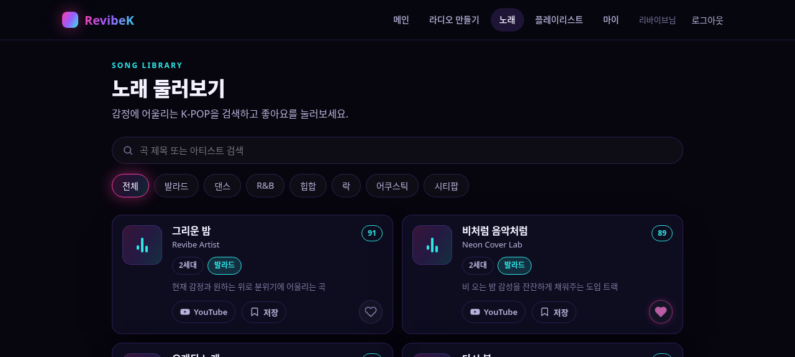
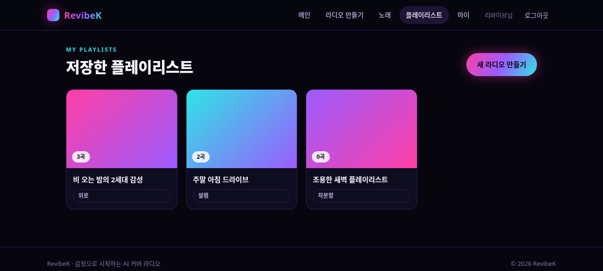
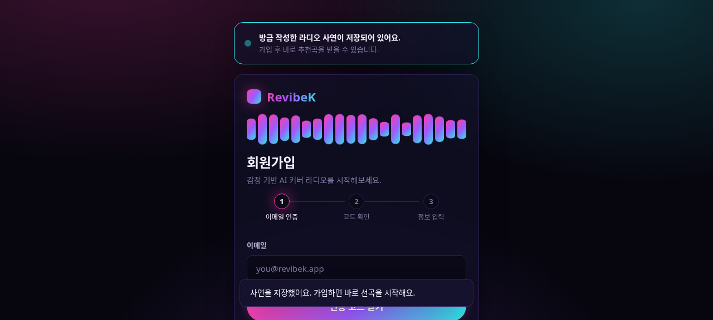
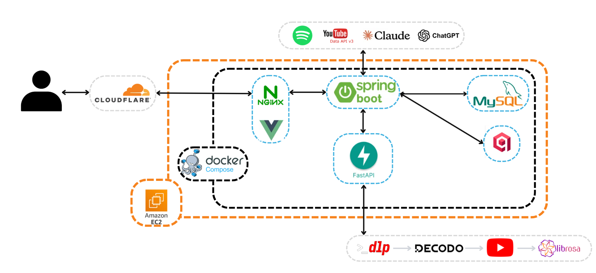

# 🎵 RevibeK — K-POP AI 라디오 서비스

> 오늘 어떤 하루였나요? 사연을 들려주면 AI DJ가 어울리는 K-POP 라디오를 만들어드려요.

**프로젝트 기간**: 2026.05.25 ~ 2026.06.26
**협업 노션**: [ReVibeK Notion](https://app.notion.com/p/ReVibeK-363ccacbbfc882abae168123324934d9)

> ⚠️ 운영 서버는 종료되었습니다. 아래 화면/문서는 개발 당시 캡처와 코드 기준 정리본입니다.

---

## 소개

RevibeK는 사용자가 적은 감정·상황·사연을 받아, 세대(2/3세대)·장르·바라는 분위기에 맞는 K-POP 곡을 추천하고, Claude 기반 AI DJ 멘트와 TTS 음성을 더해 **개인화된 라디오 세션**을 만들어주는 서비스입니다. 추천된 곡은 자동으로 플레이리스트에 담기고, 사용자는 라디오 사연을 공개해 다른 사람들과 공유(리바이브닝)할 수도 있습니다.

## 핵심 기능

- **사연 기반 라디오 생성**: 감정/상황/세대/장르/선호아티스트/제외키워드 또는 YouTube URL 입력 → mood/era/genre 13단계 DB 폴백 체인으로 시드곡 선정 → Qdrant 벡터 유사도로 최대 8곡까지 확장 → Claude AI DJ 멘트 + TTS 생성까지 한 번의 요청으로 처리
- **벡터 유사도 검색**: 곡의 오디오 특징(BPM·energy·danceability·loudness·musical key·spectral centroid 등 9차원)을 Qdrant에 색인해 유사곡을 확장 추천. MySQL(`embedding_songs`)이 벡터 본체의 단일 소스, Qdrant는 색인 캐시
- **플레이리스트**: 라디오 생성 결과를 자동/수동으로 플레이리스트에 저장·관리
- **곡 둘러보기 / 좋아요 / 리뷰**: 곡 검색·장르 필터, 좋아요, 별점·코멘트 리뷰
- **리바이브닝(공개 피드)**: 내 라디오 사연을 공개하면 `/revibening` 피드에 노출되어 다른 사용자가 둘러보고 좋아요·팔로우 가능
- **팔로우 / 청취 계획 / 챌린지**: 사용자 간 팔로우, 청취 계획 관리, K-POP 챌린지 참여
- **AI 청취 코칭**: 사용자의 청취 패턴을 분석해 감정 경향·세대 선호·인사이트 제공
- **인증**: 이메일 회원가입/로그인 + Google OAuth2 로그인(`/oauth/callback`에서 토큰 수신)

## 화면

| 사연 입력 | 라디오 생성 결과 | 메인 |
|---|---|---|
|  |  |  |

| 생성 중 | 플레이리스트 저장 결과 | 마이페이지 |
|---|---|---|
|  |  |  |

| 곡 둘러보기 | 플레이리스트 목록 | 회원가입 |
|---|---|---|
|  |  |  |

## 주요 화면 / 라우트

| 페이지 | 경로 | 설명 |
|---|---|---|
| 사연 입력 | `/radio/story` (루트 `/`가 리다이렉트) | 사이트 진입 화면. 감정·상황·세대·장르 등 입력 |
| 로그인 / OAuth 콜백 | `/login`, `/oauth/callback` | 이메일 로그인 + Google OAuth2 |
| 회원가입 | `/signup` | 이메일 인증 3단계 스테퍼 |
| 메인 홈 | `/main` | 기능 메뉴 그리드, 이어서 만들기 카드 |
| 라디오 생성중 / 결과 | `/radio/generating`, `/radio/result/:id` | 5단계 진행 표시 → DJ 멘트/TTS/추천곡 결과 |
| 플레이리스트 결과 / 목록 / 상세 | `/playlist/result/:id`, `/playlists`, `/playlists/:id` | 자동 저장 결과 확인, 목록·상세 관리 |
| 리바이브닝 | `/revibening` | 공개된 라디오 사연 피드(최신순/인기순), 좋아요·팔로우 |
| 곡 둘러보기 | `/songs` | 곡 검색, 장르 필터, 좋아요/플레이리스트 저장 |
| 마이페이지 | `/me?tab=likes\|radio\|reviews\|follow\|plan` | 좋아요·라디오기록(공개 토글)·리뷰·팔로우·청취계획 탭 |


## 아키텍처



- 사용자 → Cloudflare → Nginx → Vue 3(SPA) / Spring Boot
- Spring Boot가 MySQL(데이터)·Qdrant(벡터 검색)·외부 API(YouTube Data API, Spotify, Claude, ChatGPT)를 오케스트레이션
- 음원 분석은 FastAPI가 전담: `yt-dlp` → `decodo` → YouTube → `librosa`(오디오 특징/임베딩 추출)
- 전체 스택은 Docker Compose로 구성, Amazon EC2에 배포

```text
[Spring Boot] POST /api/analysis/{songId} / by-url / EmbeddingController.search-by-url
      │  RestTemplate
      ▼
[FastAPI] POST /api/ai/analyze
      │  yt-dlp 다운로드 → librosa 분석 → 9차원 임베딩 계산
      ▼
[Spring Boot] analyzed_songs / embedding_songs(AUDIO_9D) 저장 → QdrantService.upsert
```

FastAPI는 분석만 전담하고, DB·Qdrant 저장은 전부 Spring Boot가 소유한다.

| 디렉터리 | 스택 | 역할 |
|---|---|---|
| `RevibeK/` (본 디렉터리) | Spring Boot 4 + MyBatis + MySQL + Spring Security(JWT/OAuth2) | 메인 백엔드 API |
| `RevibeK_AI/` | FastAPI(Python) | 음악 분석 서버. `yt-dlp`/`librosa`로 오디오 특징·9차원 임베딩 추출 |
| `RevibeK_FE/` | Vue 3 + Vite + Pinia + vue-router | 프론트엔드 SPA |

### 백엔드 패키지 구조 (`com.ssafy.revibek`)

도메인별로 패키지를 분리한 Spring Boot 모놀리스(`ai`/`analysis`/`auth`/`challenge`/`coaching`/`embedding`/`explore`/`follow`/`like`/`mood`/`plan`/`playlist`/`preference`/`qdrant`/`radio`/`review`/`song`/`spotify`/`tts`/`user`/`usersong`/`youtube` + 공통 `common`/`config`)으로 구성했다. `radio`가 추천·DJ멘트·TTS·공개피드를 묶는 핵심 도메인이고, `analysis`/`embedding`/`qdrant`가 FastAPI 연동·벡터 적재를 담당한다.

## 기술 스택

| 구분 | 기술 |
|---|---|
| Backend | Spring Boot 4, MyBatis, MySQL 8.0, Spring Security(JWT + OAuth2) |
| AI 분석 | FastAPI, yt-dlp, librosa, Claude(GMS), Google TTS |
| Frontend | Vue 3, Vite, Pinia, vue-router |
| 인프라 | Docker Compose, Amazon EC2, Nginx, Cloudflare |

## 팀 구성

| 이름 | 역할 | 담당 |
|---|---|---|
| 김재원 | 백엔드 | 유저 · 라디오 |
| 김형수 | 백엔드 | 노래 · 추천 |
